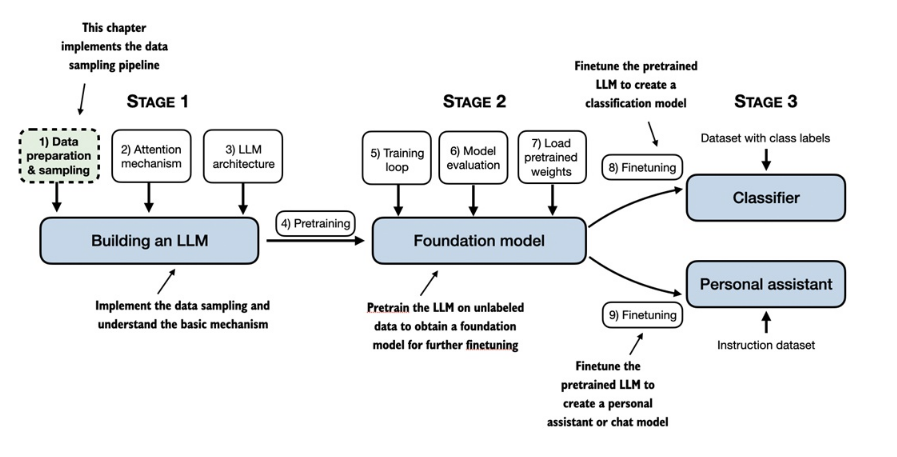
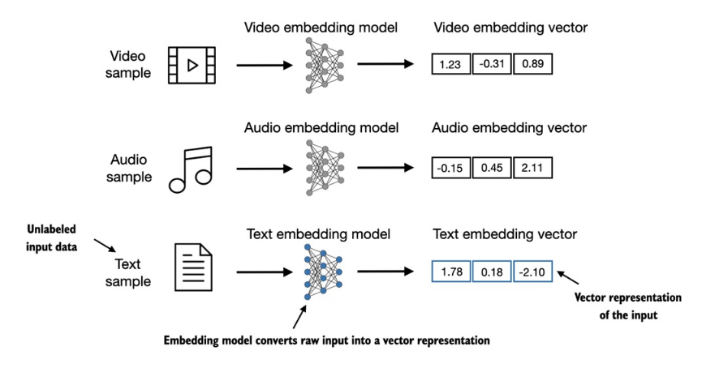

# Links
Basado en el libro: https://github.com/rasbt/LLMs-from-scratch
Repositorio oficial: https://github.com/rasbt/LLMs-from-scratch
Videos: https://www.youtube.com/watch?v=yAcWnfsZhzo&list=PLTKMiZHVd_2IIEsoJrWACkIxLRdfMlw11


# CH 1 - Prereq
## creo entorno virtual
```bash
# Creo el entorno virtual
python3 -m venv python-virtual-environment/

# activo el entorno virtual
cd /home/jose/Documentos/AI/projects/Build-a-Large-Language-Model-From-Scratch
source ./python-virtual-environment/bin/activate

# desactivo el entorno virtual
deactivate
```

## instalo los prereq
```bash
cd /home/jose/Documentos/AI/projects/Build-a-Large-Language-Model-From-Scratch/LLMs-from-scratch-main
pip install -r requirements.txt
```

## ejecuto un notebook
```bash
uv run jupyter lab
```

# CH 2 - Working with Text Data
In this chapter, you'll learn how to prepare input text for training LLMs. This
involves splitting text into individual word and subword tokens, which can
then be encoded into vector representations for the LLM. You'll also learn
about advanced tokenization schemes like byte pair encoding, which is
utilized in popular LLMs like GPT. Lastly, we'll implement a sampling and
data loading strategy to produce the input-output pairs necessary for training
LLMs in subsequent chapters.



## 2.1 Understanding word embeddings
The concept of converting data into a vector format is often referred to as
embedding.




However, it's important to note that different data formats
require distinct embedding models. For example, an embedding model
designed for text would not be suitable for embedding audio or video data.
At its core, an embedding is a mapping from discrete objects, such as words,
images, or even entire documents, to points in a continuous vector space --
the primary purpose of embeddings is to convert non-numeric data into a
format that neural networks can process.

## 2.2 Tokenizing text